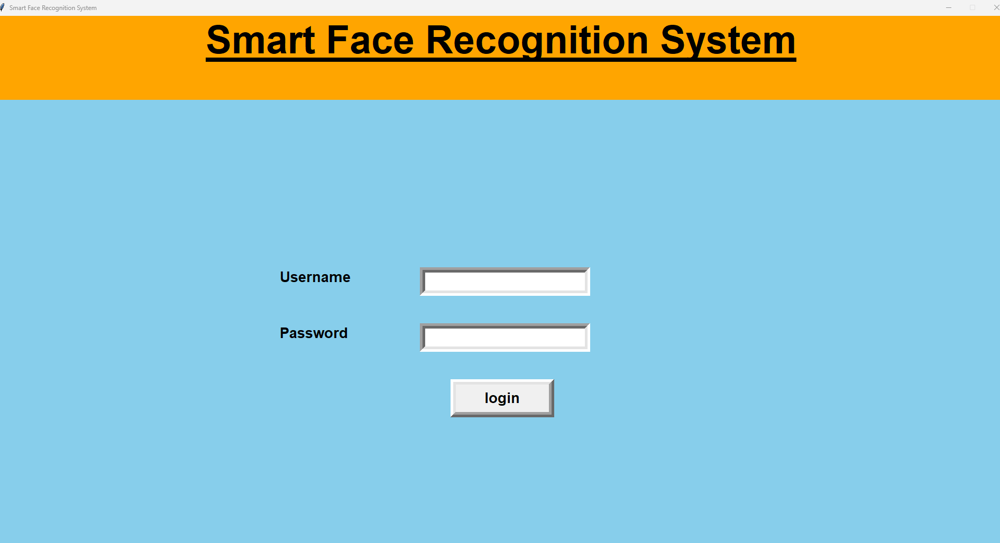
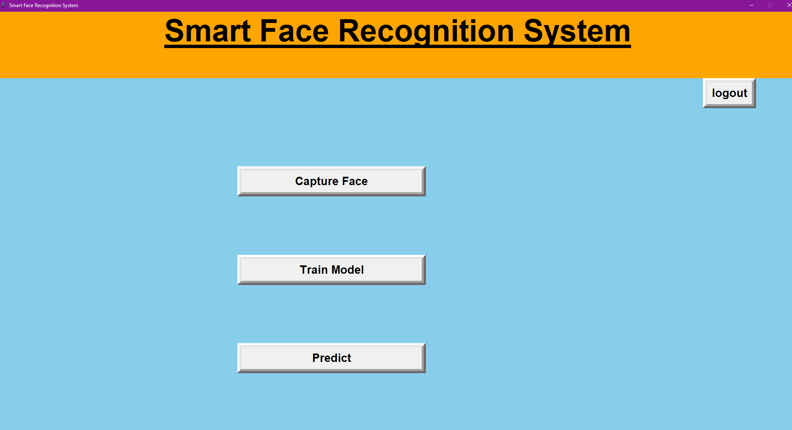
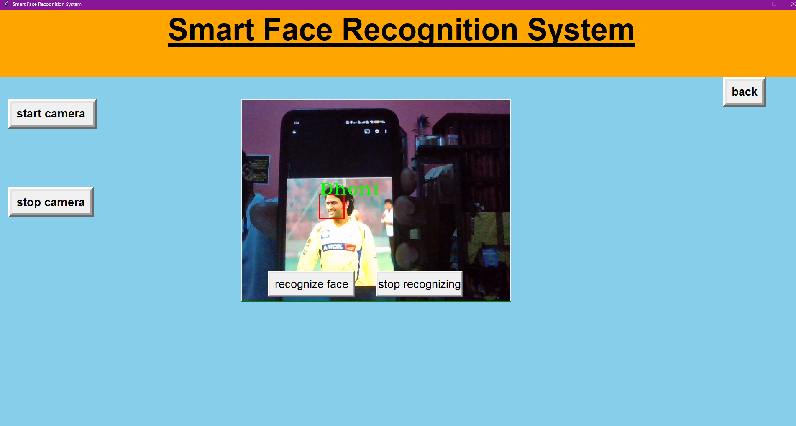
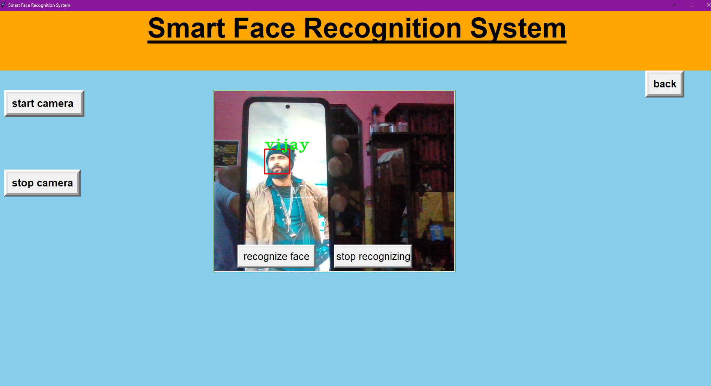

### 👁️ Smart Face Recognition System using Machine Learning

This is a GUI-based Smart Face Recognition System built using Python, Tkinter, OpenCV, and Machine Learning techniques. It can recognize faces in images, video files, and real-time webcam feeds, and also supports capturing new training data via webcam.

--- 

## 🔍 Features

 - 📹 Real-time face recognition using webcam
 - 🧠 Train and predict using PCA + Logistic Regression model
 - 🖼️ Capture 1000 images for a new user and store them in dataset
 - 🔐 Integrated simple login system
 - 🖥️ Interactive GUI made with Tkinter

--- 

## 🛠️ Technologies Used
 
 - Python
 - Tkinter (GUI)
 - OpenCV (Computer Vision)
 - PIL (Image Handling)
 - Scikit-learn (Machine Learning)
 - Haar Cascade (Face Detection)

--- 

## 📁 Project Structure
        Smart-Face-Recognition-System/

            ├── images/                              # Captured images folder collect images for training (per user)
            ├── haarcascade_frontalface_default.xml # Haar Cascade model for face detection
            ├── app.py                               # Main application code
            ├── screenshots/                         # UI screenshots
               │   ├── login_page.png
               │   ├── main_menu.png
               │   ├── image_recognition.png
            ├── README.md                            # Project documentation

---

## 🚀 Getting Started

### 1. Clone the Repository

         https://github.com/2000pawan/Smart-Face-Recognition-System.git
         cd Smart-Face-Recognition-System

### 2. Install Dependencies
Ensure you have Python 3 installed. Then, install the required libraries:

          pip install opencv-python Pillow numpy scikit-learn joblib

### 3. Run the Application

            python app.py

### 4. Login Credentials
  
  - Username: admin
  - Password: admin

## 🧠 How the Model Works

  - The system uses:

     - PCA (Principal Component Analysis) for dimensionality reduction
     - Logistic Regression for face classification

   - Steps:

      - Captured images are converted to grayscale and resized.
      - PCA reduces high-dimensional face vectors.
      - Logistic Regression predicts the identity.

## 🖼️ Screenshots

### 🔐 Login Page

### 🏠 Main Menu

### 📦 Sample Output

## 📌 Notes
Make sure haarcascade_frontalface_default.xml is in the root folder.

Capture training images using the "Capture Screen" before training a new model.

## 👨‍💻 Developed By

PAWAN YADAV

AI Engineer | 2025

📧 Contact: yaduvanshi2000pawan@gmail.com

## 📜 License
This project is licensed under the MIT License – feel free to use and modify for personal or academic purposes.

